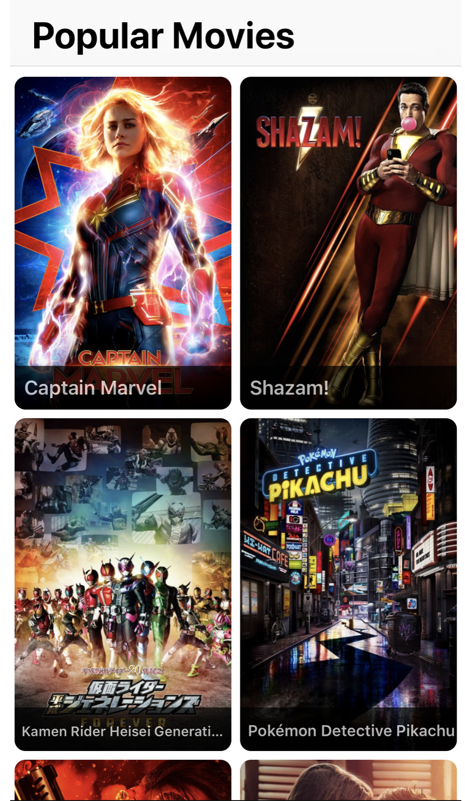
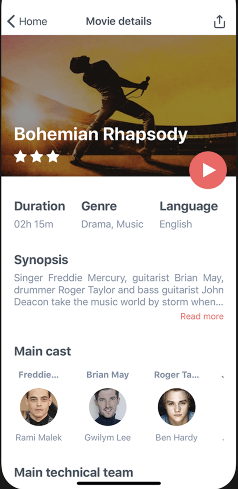

# The Movie Database (TMDb)

Необходимо реализовать 3 экрана на базе TMDb API используя **SwiftUI** 
https://developers.themoviedb.org

1) Login screen - https://developers.themoviedb.org/3/authentication/how-do-i-generate-a-session-id 
Простой экран с полями ввода и кнопкой 'Login'. Поля ввода предзаполняем кредами, основная задача организовать навигацию между экраном логина и основным экраном с фильмами

2) Popular movies - https://developers.themoviedb.org/3/movies/get-popular-movies

3) Movie details - https://developers.themoviedb.org/3/movies/get-movie-details

Функциональным должны быть только логика входа, прогрузки списка популярных фильмов, и переход на детали фильма. Все остальные элементы статичны и не требуют никакой логики, кроме заполнения из выбранного фильма.  
Можно отходить от заданной структуры UI, добавлять/изменять отображение элементов, это больше рекомендация, нежели требование.

В качестве результата выполненнй работы - ссылка на репозиторий с кодом и креды для входа в апку.
